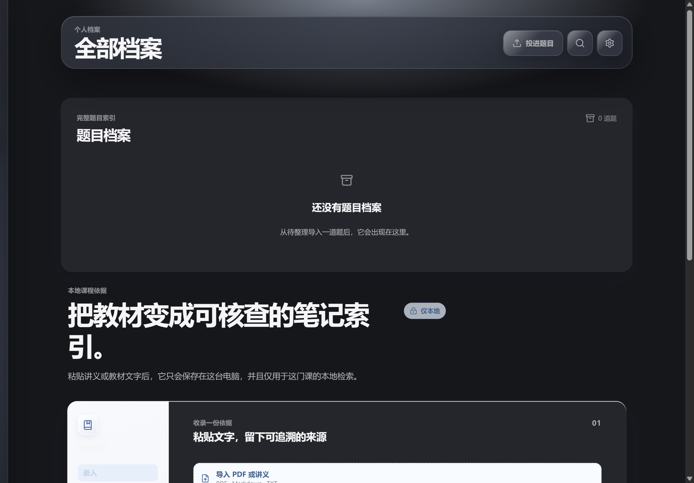
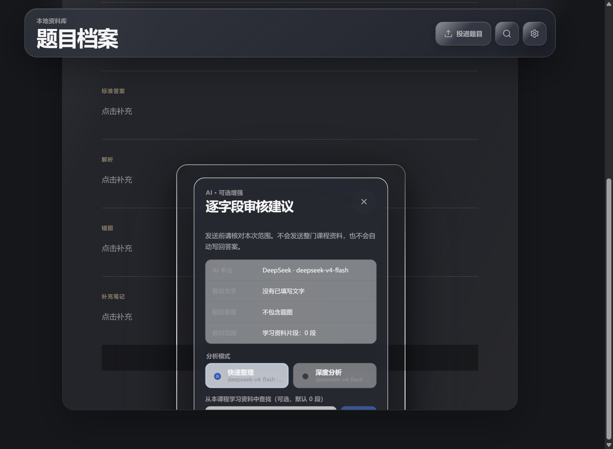
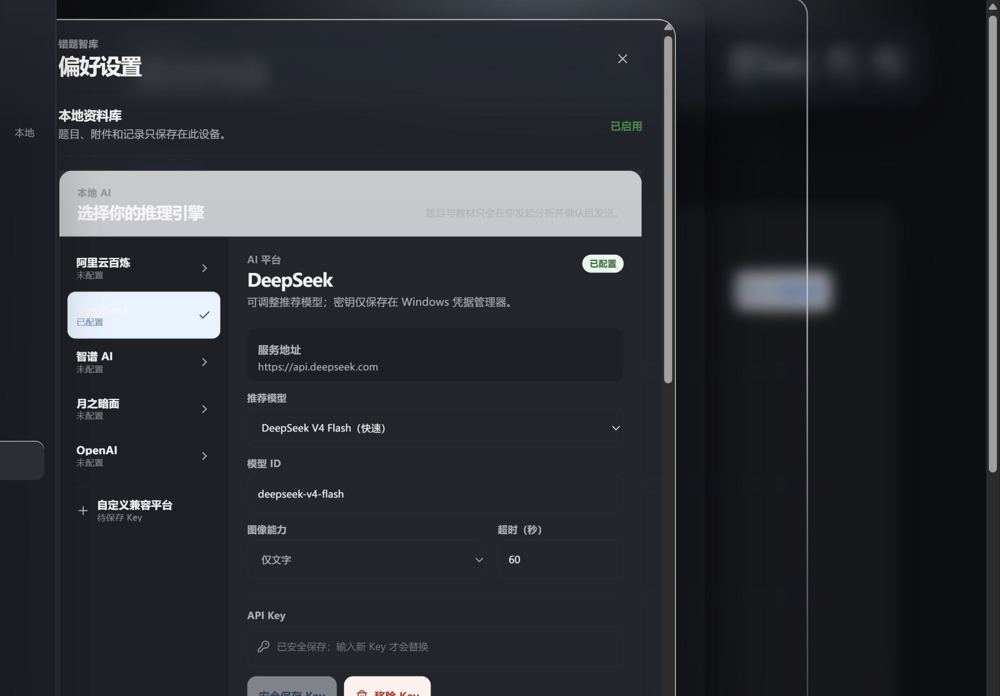
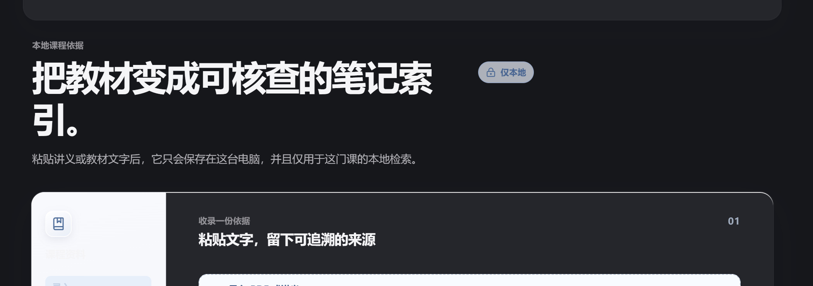

# 错题智库

> 把错题、教材依据、复习计划和知识网络，收进一份只属于你的本地学习档案。

<p>
  <a href="https://github.com/whz211417/cuoti-zhiku/releases/latest"><strong>下载 Windows 版</strong></a>
  ·
  <a href="https://github.com/whz211417/cuoti-zhiku/releases">全部版本</a>
  ·
  <a href="docs/release/windows-installation.md">安装与校验</a>
  ·
  <a href="docs/development.md">开发文档</a>
</p>


## 从一张题图，到下一次真正复习

把文件拖进窗口：题图、PDF、Markdown、TXT 都会先安全保存在本机。之后你可以慢慢补题干、写作答、整理答案；需要时再让 AI 生成可逐项审阅的建议。题目、答案、错因、知识点和教材出处始终留在同一份记录里。

```text
投进题目 / 题图 / PDF
  → 原件先落盘，进入待整理
  → 补充题干与个人作答
  → 可选 AI 提出可审核建议
  → 采纳、编辑或拒绝每个字段
  → 进入今日复习、知识网络与导出
```

## 看看实际界面

<p align="center">
  
  
</p>
<p align="center">
  
  
</p>

截图不含个人题目、课程资料或 API Key，仅展示真实的产品界面与交互。

## 三步开始

1. 从 [最新 Release](https://github.com/whz211417/cuoti-zhiku/releases/latest) 下载 `错题智库_0.4.0_x64-setup.exe`。
2. 新建课程，拖入一张题图或一份 PDF；原件会先保存，再等待你整理。
3. 到“今日复习”揭示答案并记录掌握程度；不配置 AI 也能完整使用本地学习流程。

安装包大小、SHA-256 与 SmartScreen 说明见 [Windows 安装与首启](docs/release/windows-installation.md)。

## 能做什么

| 场景 | 你得到的体验 |
| --- | --- |
| 收题 | 可从资源管理器拖入 PNG、JPG、WebP、PDF、Markdown、TXT，也支持粘贴截图。原件先按 SHA-256 内容地址安全落盘。 |
| 整理 | 题干、个人作答、标准答案、解析、错因与知识点笔记共同构成一份阅读式题目档案。 |
| 复习 | 默认先隐藏答案；用“忘记、吃力、熟悉、掌握”安排下次复习。 |
| 教材依据 | 课程资料可本地检索；AI 仅在你允许时读取少量相关片段，引用不凭空生成。 |
| AI 辅助 | 可配置百炼、DeepSeek、智谱、月之暗面、OpenAI 兼容 HTTPS 平台；建议必须逐字段审阅。 |
| 知识网络 | 按“课程—知识点—题目”回看薄弱点，并可导出 Markdown、附件和 JSON Canvas 到 Obsidian。 |
| 资料安全 | 资料可恢复、可备份、可导出；删除应用管理的本地资料时会明确确认，不会删除你的原始文件。 |

## 本地优先，不把学习资料交给产品

- 题目原件、SQLite 资料库、课程材料和复习记录默认只保存在这台 Windows 电脑上。
- 没有网络、没有 API Key 或 AI 请求失败时，收题、整理、检索、复习、备份和导出仍可使用。
- API Key 按平台与目标地址隔离保存到 Windows 凭据管理器，不进入 SQLite、备份或导出文件。
- 完整备份包含数据库与应用保存的原件；恢复前会创建救援副本。

## 当前边界

- 当前只提供 Windows x64 安装包，尚未提供自动更新或商业代码签名；SmartScreen 可能要求你确认来源。
- 当前不内置 OCR。扫描版 PDF 需要先 OCR 或手动补充题干；题目 PDF 本身仍可安全保存。
- AI 不会默认发送 PDF 全文或教材全文，只有本次明确授权的题目内容、题图和少量教材片段会进入请求范围。
- `.czkbackup` 不包含 Windows 凭据管理器中的 API Key；迁移后需要重新配置。

## 参与建设

- 遇到问题或有想法：提交 [Bug 报告](https://github.com/whz211417/cuoti-zhiku/issues/new?template=bug_report.yml) 或 [功能建议](https://github.com/whz211417/cuoti-zhiku/issues/new?template=feature_request.yml)。请勿上传真实题目原件、教材或 API Key。
- 想参与开发：先看 [贡献指南](CONTRIBUTING.md)，再提交小而清晰的改动。
- 发现安全问题：请按 [安全策略](SECURITY.md) 私下反馈，不要公开贴出密钥、学习资料或可复现攻击细节。
- 版本变化与安装包：见 [Releases](https://github.com/whz211417/cuoti-zhiku/releases)。

## 许可证

本项目使用 [MIT License](LICENSE)。
