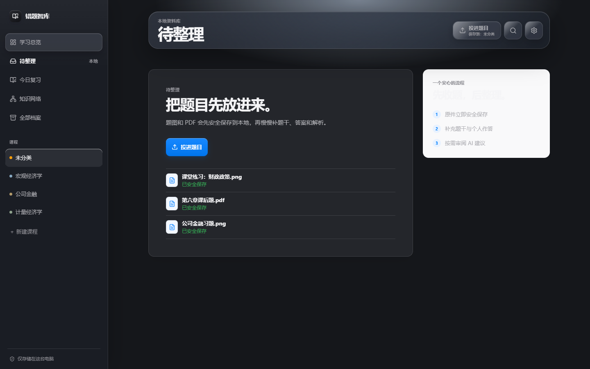
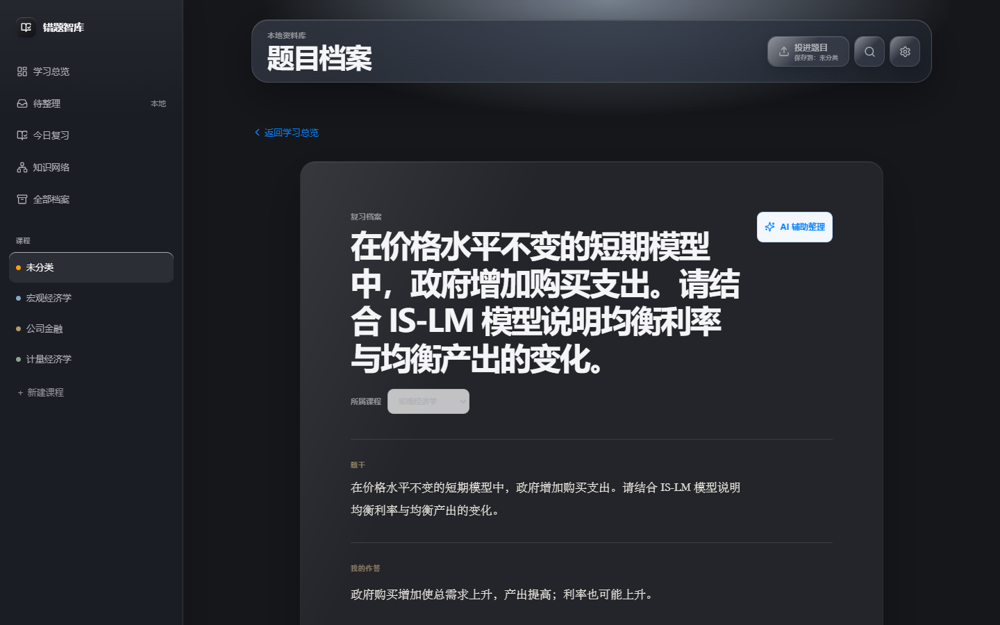
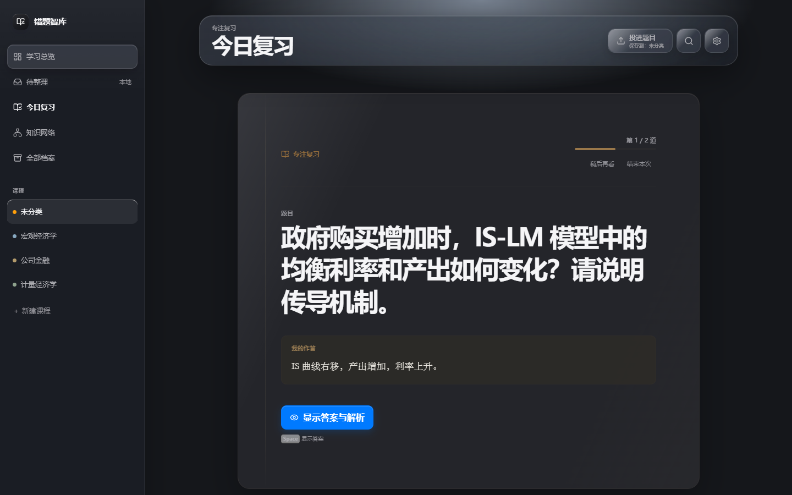
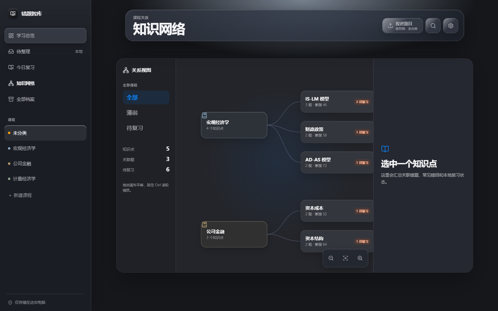
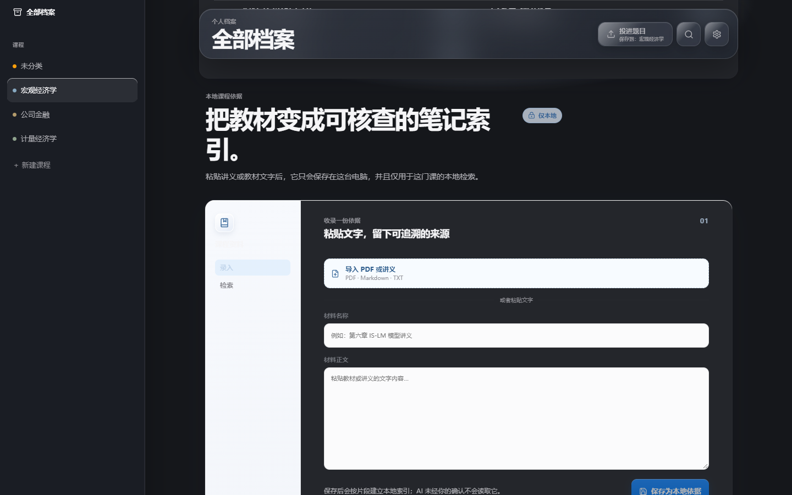

<div align="center">
  <h1>错题智库</h1>
  <p><strong>把散落的题图、教材依据和复习记录，收进一份真正属于你的本地学习档案。</strong></p>
  <p>Local-first mistake notebook and spaced-repetition workspace for Windows.</p>
  <p>
    <a href="https://github.com/whz211417/cuoti-zhiku/releases/latest"><strong>下载 Windows 最新版</strong></a>
    · <a href="docs/release/windows-installation.md">安装与校验</a>
    · <a href="https://github.com/whz211417/cuoti-zhiku/issues/new?template=feature_request.yml">提交建议</a>
  </p>
  <p>
    <a href="https://github.com/whz211417/cuoti-zhiku/releases/latest"></a>
    
    
    <a href="https://github.com/whz211417/cuoti-zhiku/actions/workflows/verify.yml"></a>
    <a href="LICENSE"></a>
  </p>
</div>


## 不是把答案分开放，而是把一次学习完整留下

过去用两个文档分别存题目和答案，整理成本高，复习时也很容易脱节。错题智库把题目原件、个人作答、标准答案、解析、错因、知识点和教材出处留在同一份记录里。

| 拖进来，先保存 | AI 只做建议 | 错题会回到复习计划 |
| --- | --- | --- |
| 题图、PDF、Markdown、TXT 会先按内容安全落盘，再进入待整理；不用先把表单填完。 | AI 是可选增强。每个字段都可以单独采纳、编辑或拒绝，不会静默改写你的答案。 | 复习时默认先看题目，再自然展开答案；根据掌握程度安排下一次出现。 |

## 一分钟理解完整流程

```text
拖入题图 / PDF / 讲义
  → 原件立刻保存到本机
  → 补题干与个人作答
  → 可选 AI 生成逐字段建议
  → 用户审核答案、解析、错因与知识点
  → 进入今日复习与知识网络
  → 导出题目册、答案解析册或 Obsidian 知识库
```

不配置 AI、没有网络或 API 请求失败时，收题、整理、检索、复习、备份和导出仍然可用。

## 你每天真正会用到的部分

| 场景 | 体验 |
| --- | --- |
| 快速收题 | 从资源管理器直接拖入 PNG、JPG、WebP、PDF、Markdown、TXT，也支持粘贴截图。 |
| 阅读式整理 | 题干、作答、答案、解析、错因与知识点组成一份题目档案，而不是连续的后台表单。 |
| 今日复习 | 默认隐藏答案；用“忘记、吃力、熟悉、掌握”记录状态并安排下次复习。 |
| 教材依据 | 讲义和教材在课程内本地检索；AI 只在本次明确允许时读取少量相关片段。 |
| 多模型 AI | 支持阿里云百炼、DeepSeek、智谱、月之暗面和 OpenAI 兼容 HTTPS 平台，自带 Key 即可。 |
| 知识网络 | 按“课程—知识点—题目”回看薄弱点，并可导出 Markdown、附件和 JSON Canvas 到 Obsidian。 |
| 数据安全 | 数据可备份、恢复和导出；删除应用管理资料时会明确确认，不触碰最初导入的原文件。 |

## 真实界面

从收题、整理、审核到复习，下面的截图来自当前版本的真实组件；示例课程与题目均为虚构数据。

### 先收下，再慢慢整理

<p align="center">
  
  
</p>

### AI 逐字段建议，复习默认隐藏答案

<p align="center">
  
  
</p>

### 从薄弱知识点回到本地教材

<p align="center">
  
  
</p>

### 自带 Key，自由选择平台与模型


截图不含个人题目、真实课程资料或 API Key，只展示当前产品界面与已经交付的能力。运行 `pnpm capture:readme` 可用固定虚构数据重新生成整套截图。

## 三步开始使用

1. 打开 [Latest Release](https://github.com/whz211417/cuoti-zhiku/releases/latest)，下载 Windows x64 安装包。首次安装完成后，日常直接从桌面或开始菜单打开。
2. 新建一门课程，把一张题图或一份 PDF 直接拖进窗口；看到“已保存”后再慢慢整理。
3. 到“今日复习”先独立作答，再展开答案并记录掌握程度。

安装包 SHA-256、SmartScreen 提示与更新方式见 [Windows 安装与首启](docs/release/windows-installation.md)。

## 为什么坚持本地优先

- 题目原件、SQLite 资料库、课程材料和复习记录默认只保存在这台电脑上。
- API Key 按平台与目标地址隔离保存到 Windows 凭据管理器，不写入 SQLite、备份或导出文件。
- AI 请求前展示本次发送范围，不会默认上传整门课程或整本教材。
- 完整备份包含数据库和应用保存的原件；恢复前会先创建救援副本。
- 应用内更新使用独立签名验证，并在有未保存题目内容时阻止安装。

## 当前边界

- 目前提供 Windows x64 版本；没有 macOS、移动端或云同步版本。
- 当前不内置 OCR。扫描版 PDF 需要先 OCR 或手动补充题干，但原文件仍会安全保存。
- 安装包尚未购买商业 Authenticode 证书，首次安装时 Windows SmartScreen 可能要求确认来源。
- `.czkbackup` 不包含 Windows 凭据管理器里的 API Key，迁移设备后需要重新配置。

## 给开发者

应用使用 Tauri 2、React、TypeScript、Rust 与 SQLite。开发环境、命令和验证要求见 [开发文档](docs/development.md)；产品决策强调本地工作流独立于 AI、引用可追溯、删除边界明确、备份可恢复。

- 参与开发：[贡献指南](CONTRIBUTING.md)
- 报告问题：[Bug 模板](https://github.com/whz211417/cuoti-zhiku/issues/new?template=bug_report.yml)
- 提出功能：[功能建议模板](https://github.com/whz211417/cuoti-zhiku/issues/new?template=feature_request.yml)
- 报告安全问题：[安全策略](SECURITY.md)
- 推广这个项目：[个人开发者推广手册](docs/marketing/launch-playbook.md)

请勿在 Issue、截图或提交中上传真实题目原件、教材、数据库、备份文件或 API Key。

## License

[MIT](LICENSE) © 2026 whz211417
